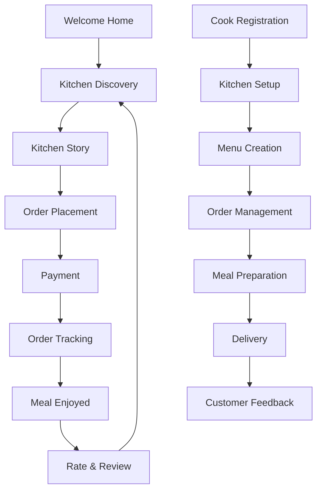
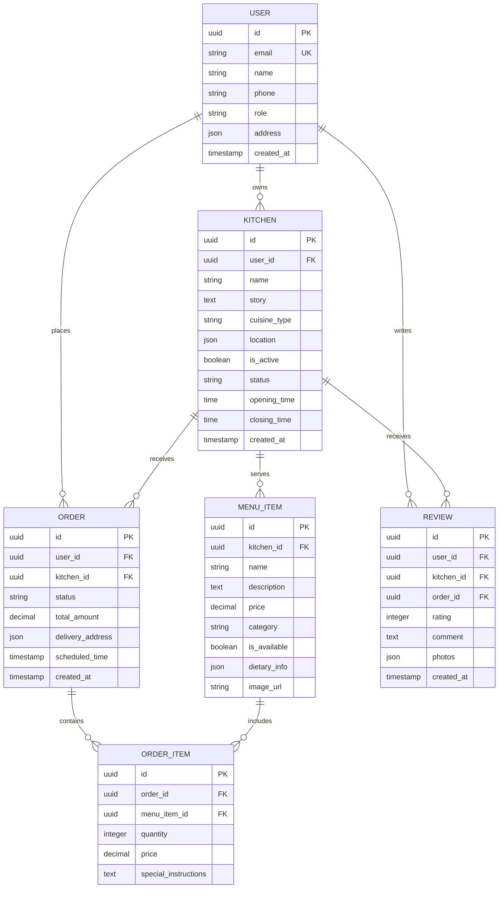

# Tiffin Finder App - Product Requirements Document

## 1. Product Overview

Tiffin Finder connects hungry hearts with the warm, nourishing meals prepared by home cooks in your neighborhood. In a world of fast food and impersonal delivery, we bring back the soul-satisfying experience of eating food made with love, just like mom used to make.

Our app bridges the gap between talented home cooks who want to share their culinary heritage and busy individuals craving authentic, home-cooked meals. Whether you're a student missing home, a professional seeking healthy alternatives, or someone discovering the joy of regional cuisines, Tiffin Finder helps you discover the hidden culinary gems in your community.

We celebrate the culture of sharing food as an act of care, where every meal tells a story and every kitchen becomes a gateway to someone's home and heart.

## 2. Core Features & User Stories

### 2.1 User Roles

| Role | Registration Method | Core Permissions |
|------|---------------------|------------------|
| Food Seeker | Email/Social registration | Browse kitchens, place orders, rate meals, save favorites |
| Home Kitchen | Verification process + approval | Create kitchen profile, manage menu, accept orders, track earnings |
| Admin | System-defined | Platform management, dispute resolution, quality control |

### 2.2 Feature Module

Our Tiffin Finder consists of the following main pages:

1. **Welcome Home Page**: Hero section with warm messaging, neighborhood kitchen discovery, featured home cooks, and seasonal specialties.

2. **Kitchen Discovery Page**: Interactive map view, cuisine filters, cook profiles, and authentic food photography.

3. **Kitchen Story Page**: Detailed cook profile, family recipes, cooking philosophy, menu showcase, and customer testimonials.

4. **Order Placement Page**: Meal selection, customization options, delivery scheduling, and special dietary requests.

5. **My Orders Page**: Order tracking, delivery updates, reorder favorites, and meal history.

6. **Cook Dashboard**: Order management, menu updates, earnings tracking, and customer feedback.

7. **Community Stories Page**: Food stories, cook interviews, recipe sharing, and cultural food education.

### 2.3 Page Details

| Page Name | Module Name | Feature description |
|-----------|-------------|---------------------|
| Welcome Home | Hero Section | Warm welcome message "Kitchens of Your Neighborhood await", rotating seasonal dish highlights, quick location detection. |
| Welcome Home | Featured Kitchens | Carousel of top-rated home cooks with personal stories, "Cook of the Month" spotlight, new kitchen alerts. |
| Kitchen Discovery | Location Search | Auto-detect location, manual address input, radius-based filtering (1-10km), neighborhood names display. |
| Kitchen Discovery | Cuisine Filters | Regional Indian cuisines, dietary preferences (veg/non-veg/jain), spice levels, meal types (breakfast/lunch/dinner). |
| Kitchen Discovery | Kitchen Cards | Cook photo, signature dish preview, rating hearts, distance indicator, "Open" status with timing, price range. |
| Kitchen Story | Cook Profile | Personal story section, "My Kitchen Philosophy" write-up, family recipe origins, cooking experience years. |
| Kitchen Story | Menu Showcase | Daily rotating menu, signature dishes with stories, ingredient sourcing details, portion size information. |
| Kitchen Story | Social Proof | Customer reviews with photos, repeat customer badges, "Neighborhood Favorite" recognition. |
| Order Placement | Meal Selection | Visual menu with appetizing photos, quantity selection, add-on options, special instructions field. |
| Order Placement | Scheduling | Same-day ordering cutoff times, advance booking up to 7 days, recurring order setup, delivery time windows. |
| Order Placement | Payment | Multiple payment options, wallet system, tip for cook option, order total transparency. |
| My Orders | Order Tracking | Real-time status updates, cook contact information, estimated delivery time, live location sharing. |
| My Orders | Meal History | Photo memories of enjoyed meals, reorder with one tap, favorite kitchens bookmarking. |
| Cook Dashboard | Order Management | Incoming order notifications, order acceptance/rejection, preparation time setting, delivery coordination. |
| Cook Dashboard | Menu Management | Easy menu updates, dish availability toggling, seasonal specials creation, pricing adjustments. |
| Community Stories | Story Feed | Cook interviews, customer food journeys, regional cuisine education, festival food traditions. |

## 3. Core Process

### Food Seeker Journey
The hungry soul opens Tiffin Finder and is greeted with "Welcome home, your next meal awaits." They share their location and immediately see kitchens in their neighborhood, each with a personal story. They explore different cooks, reading about their culinary backgrounds and family recipes. When they find a kitchen that speaks to them, they browse the menu filled with dishes that carry stories like "Grandma's secret spice blend" or "My mother's comfort food." They place an order, adding a personal note like "Cooking for my homesick daughter" and track their meal's journey from the cook's heart to their home.

### Home Cook Journey
A passionate home cook registers with "Share your kitchen love with the neighborhood." They create their kitchen profile, sharing their story about why they cook and what food means to them. They upload photos of their signature dishes and set their availability. When orders come in, they receive warm notifications like "Someone's excited to taste your food!" They prepare meals with the same love they'd give their family, update order status, and build relationships with regular customers who become like extended family.



## 4. User Experience Requirements

### 4.1 Design Style

**Color Palette**
- Primary: Terracotta (#D2691E) - evokes clay pots and earth
- Secondary: Saffron (#FF9933) - sacred and warm
- Accent: Deep Green (#228B22) - fresh ingredients
- Background: Cream (#FFF8DC) - warm and inviting
- Text: Warm Brown (#8B4513) - grounding and readable

**Typography**
- Headers: Poppins - modern and friendly
- Body: Traditional serif (Merriweather) - evokes handwritten recipes
- Special touches: Script font for cook signatures

**Visual Elements**
- Rounded corners on all cards - soft and approachable
- Hand-drawn spice illustrations as icons
- Food photography with natural lighting and steam effects
- Kitchen utensil patterns as backgrounds

**Micro-interactions**
- Heart animation when favoriting a kitchen
- Steam rising from completed orders
- Spice sprinkle effect during loading
- Handwritten "Thank you" notes after orders

### 4.2 Copywriting Guidelines

**Instead of cold, transactional language, we use warm, familial terms:**
- "Kitchens of Your Neighborhood" not "Tiffin Services"
- "Cook's Story" not "Vendor Profile"
- "Share a meal" not "Place order"
- "Kitchen Love" not "Customer Rating"
- "Cooking Schedule" not "Availability"
- "Meal Memories" not "Order History"

**Sample Copy Examples:**
- "Every meal tells a story. What's yours today?"
- "Made with the same love we serve our family"
- "From their kitchen to your heart"
- "Taste the tradition in every bite"
- "Your neighborhood's best-kept secret recipes"

### 4.3 Emotional Connection Points

**Discovery Phase**
- Personal cook stories that highlight their passion
- "Why I cook" sections with emotional narratives
- Family recipe origins and cultural significance
- Customer testimonials focusing on emotional satisfaction

**Ordering Phase**
- Personal notes section for customers to share their story
- "Cook's special touch" options (extra spice, less oil, etc.)
- Estimated preparation time with "Made fresh for you" messaging
- Cook's photo and personal message with order confirmation

**Post-Meal Phase**
- Photo memories of enjoyed meals
- Thank you notes from cooks to regular customers
- "This meal reminded me of..." sharing options
- Recipe story follow-ups and cooking tips from cooks

## 5. Technical Requirements

### 5.1 Full-Stack Architecture

**Frontend Layer**
- React 18 with TypeScript for type safety
- Tailwind CSS for responsive design
- React Router for navigation
- React Query for state management
- Socket.io for real-time order updates

**Backend Layer**
- Supabase for authentication and database
- Node.js with Express for custom business logic
- Redis for caching and session management
- SendGrid for transactional emails

**External Services**
- Google Maps API for location services
- Stripe for payment processing
- Cloudinary for image storage and optimization
- Firebase Cloud Messaging for push notifications

### 5.2 Database Schema



### 5.3 API Endpoints

**Authentication APIs**
```
POST /api/auth/register
POST /api/auth/login
POST /api/auth/logout
GET  /api/auth/profile
PUT  /api/auth/profile
```

**Kitchen Discovery APIs**
```
GET  /api/kitchens/nearby?lat={lat}&lng={lng}&radius={radius}
GET  /api/kitchens/{id}
GET  /api/kitchens/{id}/menu
GET  /api/kitchens/cuisines
GET  /api/kitchens/search?q={query}
```

**Order Management APIs**
```
POST /api/orders
GET  /api/orders/{id}
GET  /api/orders/user/{userId}
PUT  /api/orders/{id}/status
POST /api/orders/{id}/cancel
```

**Cook Dashboard APIs**
```
GET  /api/cook/orders
PUT  /api/cook/orders/{id}/accept
PUT  /api/cook/orders/{id}/reject
PUT  /api/cook/orders/{id}/ready
GET  /api/cook/analytics
POST /api/cook/menu/items
```

## 6. Success Metrics

### 6.1 User Engagement Metrics
- **Daily Active Users**: Target 1000+ DAU within 3 months
- **Session Duration**: Average 8+ minutes per session
- **Kitchen Discovery Rate**: 70% of users browse 3+ kitchens per session
- **Return User Rate**: 60% of users return within 7 days
- **Social Sharing**: 25% of users share meal experiences

### 6.2 Order Completion Metrics
- **Order Conversion Rate**: 15% from kitchen visit to order placement
- **Order Fulfillment Rate**: 95% successful order completion
- **Average Order Value**: ₹200-300 per order
- **Order Frequency**: 2+ orders per user per week
- **Customer Satisfaction**: 4.5+ average rating

### 6.3 Community Building Metrics
- **Kitchen Registration**: 50+ active kitchens per neighborhood
- **Cook Retention**: 80% of cooks remain active after 3 months
- **Customer-Cook Relationships**: 40% of customers have 3+ orders from same cook
- **Story Engagement**: 60% of users read cook stories before ordering
- **Cultural Education**: 30% of users explore community stories section

## 7. MVP vs Future Features

### 7.1 MVP Requirements (Launch Ready)

**Core Functionality**
- User registration and authentication
- Location-based kitchen discovery
- Basic kitchen profiles with photos and descriptions
- Simple menu display and ordering system
- Payment integration
- Order tracking and notifications
- Rating and review system

**MVP Success Criteria**
- 100+ registered kitchens across 5 neighborhoods
- 1000+ registered food seekers
- 500+ successful orders in first month
- 4.0+ average app store rating
- 24-hour customer support response time

### 7.2 Future Enhancements (Post-Launch)

**Advanced Features**
- Subscription-based meal plans
- Cook certification and training programs
- Recipe sharing and cooking classes
- Festival and seasonal menu specials
- Corporate catering services
- Nutrition tracking and dietary planning
- Video stories and cooking demonstrations
- Community events and food festivals

**Expansion Opportunities**
- Multi-city expansion
- International cuisine categories
- Kitchen equipment marketplace
- Cook mentorship programs
- Food blogging and content creation
- Partnerships with local farmers
- Sustainable packaging solutions
- Nutritionist consultation services

### 7.3 Technical Roadmap

**Phase 1 (Months 1-3)**: MVP launch with core features
**Phase 2 (Months 4-6)**: Enhanced discovery and personalization
**Phase 3 (Months 7-9)**: Community features and social elements
**Phase 4 (Months 10-12)**: Advanced analytics and business intelligence

This document serves as the foundation for building Tiffin Finder into a platform that not only connects hungry people with home cooks but also preserves and celebrates the beautiful tradition of sharing food made with love. Every feature, every interaction, and every word should remind users that they're not just ordering food – they're participating in a cultural celebration of care, community, and culinary heritage.